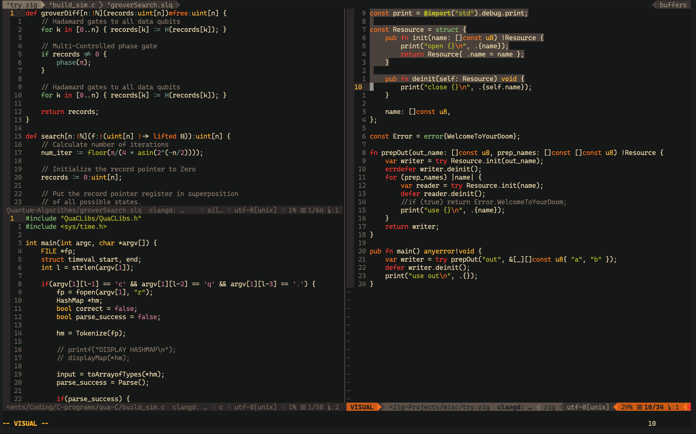

# Vim-config
This is my vim configuration file in which I have customised tthe motions according to my convenience.

**NOTE:** You should have `VimPlug` installed before setting this config to your `vim` or `neovim`.

### For vanilla vim
1. Copy the contents of folder `Vim-with-plugins` to your `$HOME/.vim` folder and rename the **init.vim** file as **.vimrc**.

2. Run `:PlugInstall`.

### For neovim
1. Copy the contents of folder `Vim-with-plugins` to your `$HOME/.config/nvim` folder.

2. Run `:PlugInstall`.

## Final look

This is the final look for this config for Neovim.

**Enjoy your new vim configuration!**
